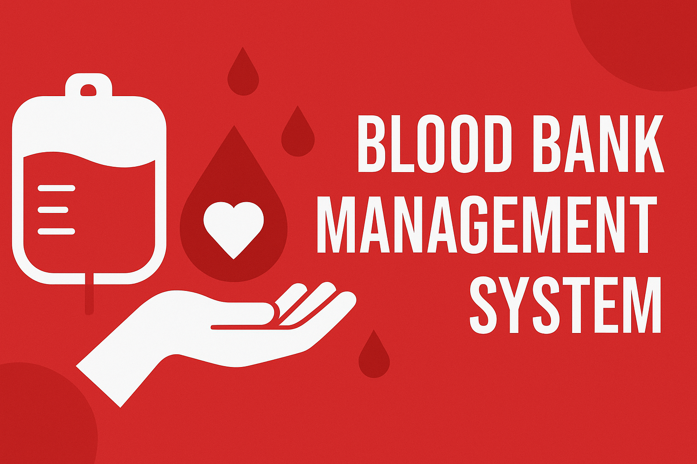
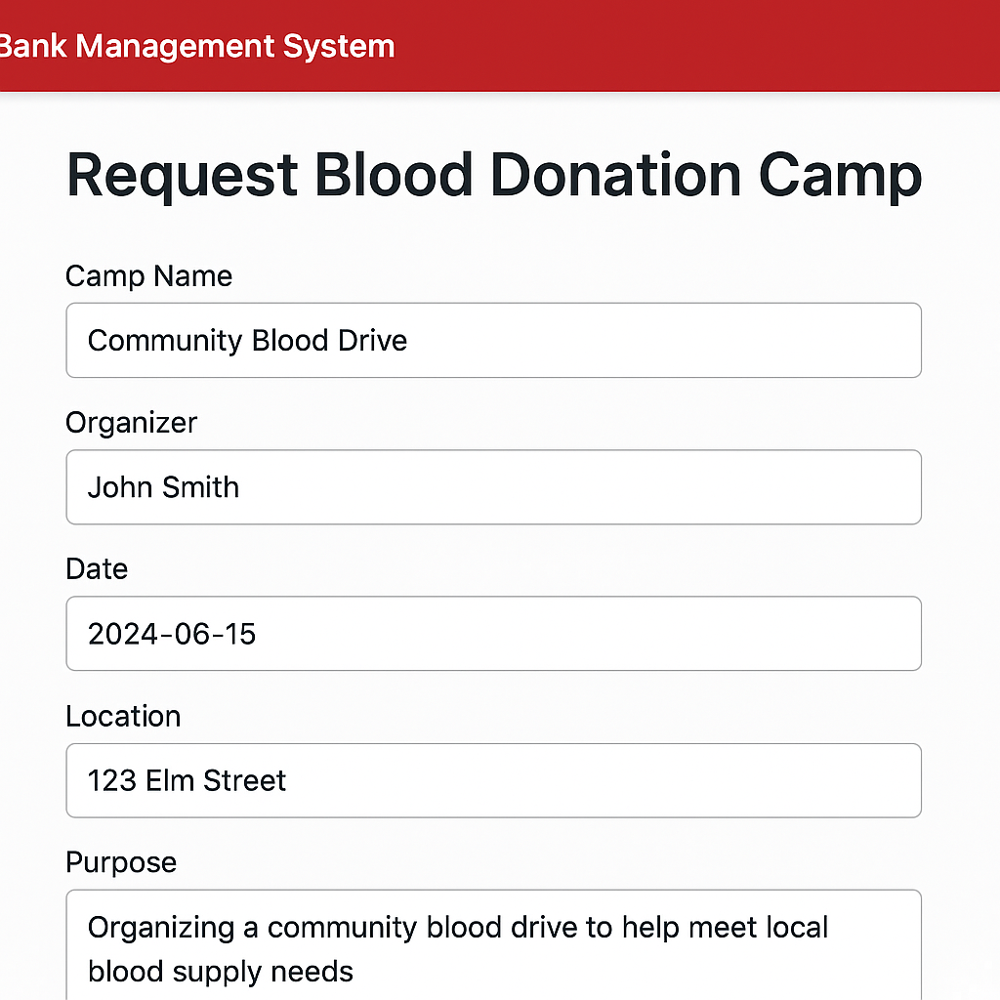
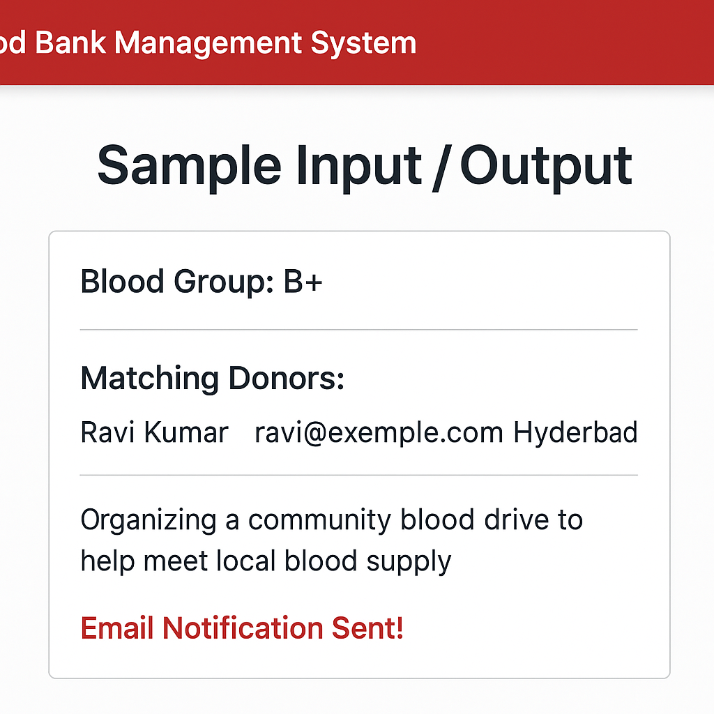

# 🩸 Blood Bank Management System

A web-based **Blood Bank Management System** built using **PHP**, **MySQL**, and **Bootstrap 5** to streamline the process of blood donation, request handling, and blood camp management. This project enables **Donors**, **Requesters**, and **Admins** to interact through an intuitive and responsive interface.

---
## 🏗️ Project Structure
<pre>
bloodbank_management_system/
│
├── index.php
├── login.php
├── register.php
├── register_action.php
├── donor_dashboard.php
├── requester_dashboard.php
├── admin_dashboard.php
├── add_camp.php
│
├── db.php
├── utils.php
│
├── assets/
│   ├── css/style.css
│   └── images/
│       ├── bloodbank_banner.png
│       ├── sample_login.png
│       ├── sample_donor.png
│       └── sample_search_result.png
│
├── sql/
│   └── schema.sql
│
├── requirements.txt
└── README.md
</pre>
---

## 🚀 Live Preview (Optional)
**[Deploy on InfinityFree / 000webhost if needed]**

---

## 🧩 Features

- 👤 **User Authentication**  
  Secure login and registration for Donors, Requesters, and Admins.

- 🔎 **Search Functionality**  
  Requesters can search for available donors by blood group.

- 📅 **Blood Camp Management**  
  Admins can add and manage upcoming blood donation camps.

- 📩 **Email Notifications**  
  Donor alert emails when a requester initiates a search.

- 🎨 **Responsive UI**  
  Clean and mobile-friendly design using Bootstrap 5.

---

## 🖥️ Screenshots

### 🔐 Login Page

### 🧑‍🦰 Donor Dashboard

### 🔍 Requester Search Result

---

## 🧪 Sample Input / Output

### ➕ Donor Registration (Input)
Name: Ravi Kumar  
Email: ravi@example.com  
Password: ******  
Blood Group: B+  
Location: Hyderabad
## ✅ Requester Search (Input)

Blood Group: B+
## 🎯 Output (Search Result)

Matching Donors:
- Ravi Kumar | ravi@example.com | Hyderabad
Email Notification Sent!

## ⚙️ How to Run Locally
🛠️ Install XAMPP or any PHP server.

📁 Move this folder into htdocs/ inside the XAMPP installation directory.

🧬 Import the database:

Open phpMyAdmin

Create a database named blood_bank

Import sql/schema.sql into it

🔧 Update db.php with your DB credentials if needed.

🌐 Open http://localhost/bloodbank_management_system in your browser.

## 📚 Tech Stack
Frontend: HTML, CSS, Bootstrap 5

Backend: PHP (Procedural)

Database: MySQL

Email: PHP mail() (basic notification system)

## 👨‍💻 Contributors

Sanku Rajshree Rao

## 💡 Future Improvements
SMS notifications via Twilio

PHPMailer integration for real email alerts

Donor availability calendar

PDF download for camp records

# 📜 License
This project is open source and free to use under the MIT License .
 .
